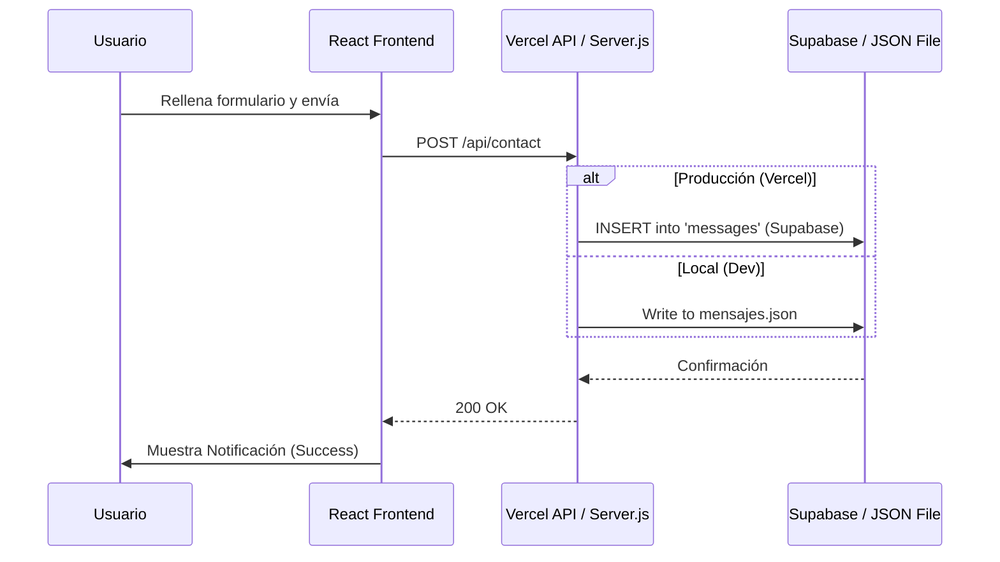

# Luis Figueira - Professional Portfolio

Este es el portafolio profesional de Luis Figueira, una aplicación web moderna construida con **React** y **Vite**, diseñada para mostrar experiencia laboral, proyectos y certificaciones. Incluye un backend ligero en **Node.js** (Serverless en Vercel) para gestionar mensajes de contacto.

## 🚀 Características Principales

*   **⚡ Frontend Moderno:** Desarrollado con React 18 y Vite para un rendimiento óptimo.
*   **🎨 Tema Dinámico (Dark/Light Mode):** Sistema robusto de cambio de tema con persistencia y detección automática de preferencia del sistema.
*   **🌍 Internacionalización (i18n):** Soporte completo para Español (ES), Inglés (EN) y Portugués (PT).
*   **📱 Diseño Responsivo:** Adaptado perfectamente a móviles (incluyendo fixes específicos para iOS), tablets y escritorio.
*   **📩 Sistema de Contacto Real:** Integración con **Supabase** para almacenamiento persistente de mensajes en producción.
*   **🔔 Notificaciones UI:** Sistema de feedback visual (Toasts) para interacciones del usuario.

## 🛠️ Stack Tecnológico

### Frontend
*   **React:** Librería UI principal.
*   **Vite:** Build tool y servidor de desarrollo.
*   **i18next:** Gestión de traducciones.
*   **CSS Variables:** Para la gestión eficiente de temas (colores, espaciados).
*   **React Router:** Navegación SPA (Single Page Application).

### Backend (Producción - Vercel)
*   **Vercel Serverless Functions:** API (`api/contact.js`, `api/messages.js`).
*   **Supabase:** Base de datos PostgreSQL para almacenar los mensajes.

### Backend (Desarrollo Local)
*   **Node.js & Express:** Servidor local (`server.js`) que simula la API.
*   **File System (JSON):** Almacenamiento local en archivos.

## 📐 Arquitectura del Proyecto

### Flujo de Datos (Contacto)



## 📂 Estructura de Directorios

```text
/
├── api/                  # Vercel Serverless Functions (Prod)
├── formularios/          # Almacenamiento local (Dev only - .gitignored)
├── src/
│   ├── config/           # Constantes globales
│   ├── components/       # Componentes reutilizables
│   ├── hooks/            # Custom Hooks
│   ├── pages/            # Vistas principales (incluye Admin)
│   ├── i18n/             # Traducciones
│   └── styles/           # Estilos globales
├── server.js             # Servidor Backend Local
└── supabase_schema.sql   # SQL para configurar la DB
```

## 💻 Instalación y Ejecución

### 1. Instalar Dependencias
```bash
npm install
```

### 2. Iniciar Desarrollo Local
Esto iniciará tanto el servidor backend local (puerto 3001) como el frontend (puerto 5173).
```bash
# Terminal 1: Backend
node server.js

# Terminal 2: Frontend
npm run dev
```

### 3. Configuración de Producción (Supabase)
Para que los mensajes funcionen en Vercel:
1.  Crea un proyecto en [Supabase](https://supabase.com).
2.  Ejecuta el SQL de `supabase_schema.sql` en el SQL Editor de Supabase.
3.  Añade las variables de entorno en Vercel:
    *   `SUPABASE_URL`
    *   `SUPABASE_ANON_KEY`

---
*Desarrollado con asistencia de IA para Luis Figueira.*
